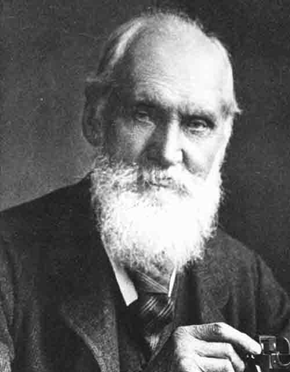
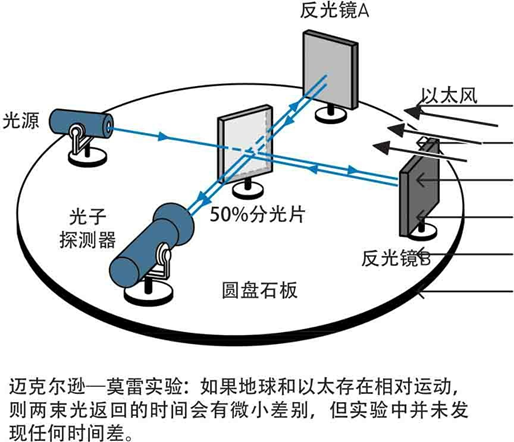
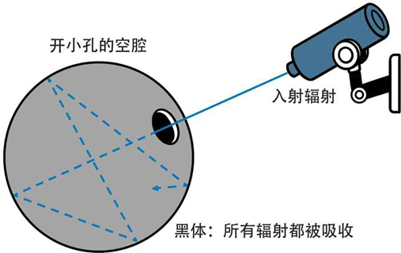
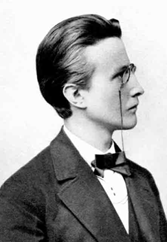
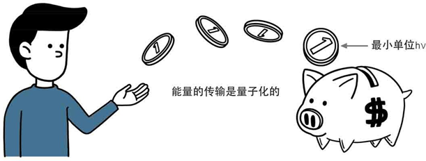
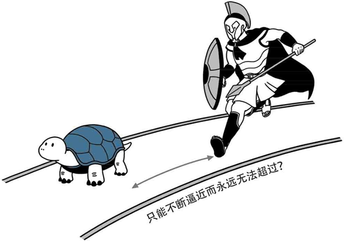

# 2  Dark Clouds  乌云

## **Part. 1**

1900年的4月27日，伦敦的天气还有一些阴冷。马路边的咖啡店里，人们兴致勃勃地谈论着当时正在巴黎举办的万国博览会。街上的报童在大声叫卖报纸，那上面正在讨论中国义和团运动最新的局势进展以及各国在北京使馆人员的状况。一位绅士彬彬有礼地扶着贵妇人上了马车，赶去听普契尼的歌剧《波希米亚人》。两位老太太羡慕地望着马车远去，对贵妇帽子的式样大为赞叹。但不久后，她们就找到了新的话 题，开始对拉塞尔伯爵的离婚案评头论足起来。看来，即使是新世纪的到来，也不能改变这个城市古老而传统的生活方式。

相比之下，在阿尔伯马尔街皇家研究所（Royal Institution, Albemarle Street）举行的报告会就没有多少人注意了。伦敦的上流社会好像已经把他们对科学的热情在汉弗来·戴维爵士（Sir Humphry Davy）那里倾注得一干二净，以致在其后几十年的时间里都表现得格外漠然。不过，对科学界来说，这可是一件大事。欧洲有名的科学家都赶来这里，聆听这位德高望重，然而却以顽固出名的老头子―开尔文男爵（Lord Kelvin，本名William Thomson）的发言。

开尔文的这篇演讲名为《在热和光动力理论上空的19世纪乌云》。当时已经76岁，白发苍苍的他用那特有的爱尔兰口音开始了发言，他的第一段话是这么说的：“动力学理论断言，热和光都是运动的方式。但现在这一理论的优美性和明晰性却被两朵乌云遮蔽，显得黯然失色了……”（The beauty and clearness of the dynamical theory, which asserts heat andlight to be modes of motion, is at present obscured by two clouds...）

这个“乌云”的比喻后来变得如此出名，以致几乎在每一本关于物理史的书籍中都被反复地引用，成为一种模式化的陈述。联系到当时人们对物理学大一统的乐观情绪，许多时候这个表述又变成了“在物理学阳光灿烂的天空中飘浮着两朵小乌云”。这两朵著名的乌云，分别指的是经典物理在光以太和麦克斯韦－玻尔兹曼能量均分学说上遇到的难 题。再具体一些，指的就是人们在迈克尔逊－莫雷实验和黑体辐射研究中的困境。

我们首先简单地讲讲第一朵乌云，即迈克尔逊－莫雷实验（Michelson-Morley Experiment）。这个实验的用意在于探测光以太对于地球的漂移速度。在人们当时的观念里，以太代表了一个绝对静止的参考系，而地球穿过以太在空间中运动，就相当于一艘船在高速行 驶，迎面会吹来强烈的“以太风”。迈克尔逊在1881年进行了一个实 验，想测出这个相对速度，但结果并不十分令人满意。于是他和另外一位物理学家莫雷合作，在1886年安排了第二次实验。这可能是当时物理史上进行过的最精密的实验了：他们动用了最新的干涉仪，为了提高系统的灵敏度和稳定性，他们甚至多方筹措弄来了一块大石板，把它放在一个水银槽上，这样就把干扰的因素降到了最低。

然而实验结果却让他们震惊且失望无比：两束光线根本就没有表现出任何的时间差。以太似乎对穿越于其中的光线毫无影响。迈克尔逊和莫雷不甘心地一连观测了四天，本来甚至想连续观测一年以确定地球绕太阳运行四季对以太风造成的差别，但因为这个否定的结果是如此清晰而不容置疑，这个计划也被无奈地取消了。

迈克尔逊－莫雷实验是物理史上最有名的“失败的实验”。它当时在物理界引起了轰动，因为“以太”这个概念作为绝对运动的代表，是经典物理学和经典时空观的基础。而这根支撑着经典物理学大厦的梁柱竟然被一个实验的结果而无情地否定，那马上就意味着整个物理世界的轰然崩塌。不过，那时候再悲观的人也不认为刚刚取得了伟大胜利，到达光辉顶峰的经典物理学会莫名其妙地就这样倒台，所以人们还是提出了许多折中的办法：爱尔兰物理学家费兹杰惹（George FitzGerald）和荷兰物理学家洛伦兹（Hendrik Antoon Lorentz）分别独立地提出了一种假说，认为物体在运动的方向上会发生长度的收缩，从而使得以太的相对运动速度无法被测量到。这些假说虽然使得“以太”的概念得以继续保留，但业已对它的意义提出了强烈的质问。因为很难想象，一个只具有理论意义的“假设物理量”究竟有多少存在的必要。果不其然，当相对论被提出后，“以太”的概念终于光荣退休，成为一个历史名 词，不过那是后话了。

开尔文所说的“第一朵乌云”就是在这个意义上提出来的。不过他认为长度收缩的假设无论如何已经使人们“摆脱了困境”，所要做的只是修改现有理论以更好地使以太和物质的相互作用得以自洽罢了。这朵乌云最终是会消失的。

至于“第二朵乌云”，指的是黑体辐射实验和理论的不一致。它是我们故事的一条主线，所以我们会在后面的章节里仔细地探讨这个问 题。在开尔文发表演讲的时候，这个问题仍然没有任何能够得到解决的迹象，不过开尔文对此的态度倒也是乐观的，因为他本人并不相信玻尔兹曼的能量均分学说，他认为要驱散这朵乌云，最好的办法就是否定玻尔兹曼的学说。而且说老实话，玻尔兹曼的分子运动理论在当时的确还有着巨大的争议，以致这位罕见的天才苦闷不堪，精神出现了问题。当年玻尔兹曼自杀未成，但他在6年后的一片小森林里还是亲手结束了自己的生命，留下了一个科学史上的大悲剧。

年迈的开尔文站在讲台上，台下的听众对他的发言给予热烈的掌 声。然而当时他们中间却没有一个人（包括开尔文自己）会了解，这两朵小乌云对于物理学来说究竟意味着什么。他们绝对无法想象，正是这两朵不起眼的乌云马上就要给这个世界带来一场前所未有的狂风暴雨、电闪雷鸣，并引发可怕的大火和洪水，彻底摧毁现在的繁华美丽。旧世界的一切将被彻底地荡涤干净，曾经以为可以高枕无忧的人们将被抛弃到荒野中，不得不在痛苦的探索中过上30年艰难潦倒、颠沛流离的生 活。他们更无法预见的是，正是这两朵乌云，终究会给物理学带来伟大的新生，在烈火和暴雨中实现涅槃，并重新建造起两幢更加壮观美丽的城堡。

第一朵乌云，最终导致了相对论革命的爆发。第二朵乌云，最终导致了量子论革命的爆发。

今天看来，开尔文当年的演讲简直像一个神秘的谶言，似乎在冥冥中带有一种宿命的意味。科学在他的预言下转了一个大弯，不过方向却是完全出乎开尔文意料的。如果这位老爵士能够活到今天，读到物理学在新世纪里的发展历史，他是不是会为他当年的一语成谶而深深震惊，在心里面打一个寒噤呢？

### 饭后闲话：伟大的“意外”实验

我们今天来谈谈物理史上的那些著名的“意外”实验。用“意外”这个词，指的是实验未能取得预期的成果，可能在某种程度上，也可以称为“失败”实验吧。

我们在上面已经谈到了迈克尔逊－莫雷实验，这个实验的结果是如此地令人震惊，以致它的实验者在相当一段时期里都不敢相信自己结果的正确性。但正是这个否定的证据，最终使得“光以太”的概念寿终正寝，使相对论的诞生成为可能。这个实验的失败在物理史上却应该说是一个伟大的胜利，科学从来都是只相信事实的。

近代科学历史上，也曾经有过许多类似的具有重大意义的意外实 验。也许我们可以从拉瓦锡（Antoine Laurent Lavoisier）谈起。当时的人们普遍相信，物体燃烧是因为有“燃素”离开物体的结果。但是 1774年的某一天，拉瓦锡决定测量一下这种“燃素”的具体重量是多 少。他用他的天平称量了一块锡的重量，随即点燃它。等金属完完全全地烧成灰烬之后，拉瓦锡小心翼翼地把每一粒灰烬都收集起来，再次称量了它的重量。

结果令当时的所有人瞠目结舌。按照燃素说，燃烧是燃素离开物体的结果，所以显然，燃烧后的灰烬应该比燃烧前要轻。退一万步来讲，就算燃素完全没有重量，也应该一样重。可是拉瓦锡的天平却说，灰烬要比燃烧前的金属重，测量燃素重量成了一个无稽之谈。然而拉瓦锡在吃惊之余，却没有怪罪于自己的天平，而是将怀疑的眼光投向了燃素说这个庞然大物。在他的推动下，近代化学终于在这个体系倒台的轰隆声中建立了起来。

到了1882年，实验上的困难同样困扰了剑桥大学的化学教授瑞利（J.W.S. Rayleigh）。他为了一个课题，需要精确地测量各种气体的比重。然而在氮的问题上，瑞利却遇到了麻烦。事情是这样的，为了保证结果的准确，瑞利采用了两种不同的方法来分离气体。一种是通过化学家们熟知的办法，用氨气来制氮；另一种是从普通空气中，尽量地除去氧、氢、水蒸气等别的气体，这样剩下的就应该是纯氮气了。然而瑞利却苦恼地发现两者的重量并不一致，后者要比前者重了千分之二。

虽然是一个小差别，但对于瑞利这样讲究精确的科学家来说是不能容忍的。为了消除这个差别，他想尽了办法，几乎检查了所有的仪器，重复了几十次实验，但是这个千分之二的差别总是顽固地存在，反而随着每一次测量更加精确起来。这个障碍使得瑞利几乎发疯，在百般无奈下他写信向另一位化学家拉姆塞（William Ramsay）求救。后者敏锐地指出，这个重量差可能是由于空气里混有了一种不易察觉的重气体而造成的。在两者的共同努力下，氩气（Ar）终于被发现了，并最终导致了整个惰性气体族的发现，成为了元素周期表存在的一个主要证据。

另一个值得一谈的实验是由1896年的贝克勒尔做出的。当时X射线刚被发现不久，人们对它的来由还不是很清楚。有人提出太阳光照射荧光物质能够产生X射线，于是贝克勒尔对此展开了研究：他选了一种铀的氧化物作为荧光物质，把它放在太阳下暴晒，结果发现它的确使黑纸中的底片感光了。贝克勒尔得出初步结论：阳光照射荧光物质的确能产生X射线。

但是，正当他要进一步研究时，意外的事情发生了。天气转阴，乌云一连几天遮蔽了太阳。贝克勒尔只好把他的全套实验用具，包括底片和铀盐放进了保险箱里。然而到了第五天，天气仍然没有转晴的趋势，贝克勒尔忍不住了，决定把底片冲洗出来再说。铀盐曾受了一点微光的照射，不管如何在底片上应该留下一些模糊的痕迹吧？

然而，在拿到照片时，贝克勒尔的脑中却是一片晕眩。底片曝光得如此彻底，上面的花纹是如此地清晰，甚至比在强烈阳光下都要超出一百倍。这是一个历史性的时刻，元素的放射性第一次被人们发现了，虽然是在一个戏剧性的背景下。贝克勒尔的惊奇，终究打开了通向原子内部的大门，使得人们很快就看到了一个全新的世界。

在量子论的故事后面，我们会看到更多这样的意外。这些意外，为科学史添加了一份绚丽的传奇色彩，也使人们对神秘的自然更加兴致勃勃。那也是科学给我们带来的快乐之一啊。

## Part. 2

上次说到，开尔文在20世纪初提到了物理学里的两朵“小乌云”。其中第一朵是指迈克尔逊－莫雷实验令人惊奇的结果，第二朵则是人们在黑体辐射的研究中所遇到的困境。

请诸位做个深呼吸，因为我们的故事终于要进入正轨了。归根结底，这一切的一切，原来都要从那令人困惑的“黑体”开始。

大家都知道，一个物体之所以看上去是白色的，那是因为它反射所有频率的光波；反之，如果看上去是黑色的，那是因为它吸收了所有频率的光波的缘故。物理上定义的“黑体”，指的是那些可以吸收全部外来辐射的物体，比如一个空心的球体，内壁涂上吸收辐射的涂料，外壁开一个小孔。那么，因为从小孔射进球体的光线无法反射出来，这个小孔看上去就是绝对黑色的，即是我们定义的“黑体”。

19世纪末，人们开始对黑体模型的热辐射问题发生兴趣。其实，很早的时候，人们就已经注意到，对不同的物体，热和辐射频率似乎有一定的对应关联。比如金属，有过生活经验的人都知道，要是我们把一块铁放在火上加热，那么到了一定温度的时候，它会变得暗红起来（其实在这之前有不可见的红外线辐射），温度再高些，它会变得橙黄，到了极度高温的时候，如果能想办法不让它汽化了，我们可以看到铁块将呈现蓝白色。也就是说，物体的辐射能量、频率和温度之间有着一定的函数关系（在天文学里，有“红巨星”和“蓝巨星”，前者呈暗红色，温度较低，通常属于老年恒星；而后者的温度极高，是年轻恒星的典范）。

问题是，物体的辐射能量和温度究竟有着怎样的函数关系呢？

最初对于黑体辐射的研究是基于经典热力学的基础之上的，而许多著名的科学家在此之前也已经做了许多准备工作。美国人兰利（Samuel Pierpont Langley）发明的热辐射计是最好的测量工具，配合罗兰凹面光栅，可以得到相当精确的热辐射能量分布曲线。“黑体辐射”这个概念则是由伟大的基尔霍夫提出，并由斯特藩（Josef Stefan）加以总结和研究的。到了19世纪80年代，玻尔兹曼建立了他的热力学理论，种种迹象也表明，这是黑体辐射研究的一个强大理论武器。总而言之，这一切就是威廉·维恩（Wilhelm Wien）准备从理论上推导黑体辐射公式的时候，物理界在这一课题上的一些基本背景。

维恩于1864年1月13日出生于东普鲁士，是当地一个农场主的儿子。在海德堡、哥廷根和柏林大学度过了他的学习生涯并取得博士学位之后，维恩先是回到故乡，继承父业，一本正经地管理起了家庭农场。眼看他从此注定要成为下一代农场主，1890年的一份合同改变了他和整个热力学的命运。德国帝国技术研究所（Physikalisch Technische Reichsanstalt，PTR）邀请他加入作为亥姆霍兹的助手，担任亥姆霍兹实验室的主要研究员。考虑到当时的经济危机，维恩接受了这个合同。就是在柏林的这个实验室里，他准备一展自己在理论和实验物理方面的天赋，彻底解决黑体辐射这个问题。

维恩从经典热力学的思想出发，假设黑体辐射是由一些服从麦克斯韦速率分布的分子发射出来的，然后通过精密的演绎，他终于在1894年提出了他的辐射能量分布定律公式：  
$$
\rho=b\lambda^{-5}e^{-\frac{a}{\lambda T}}
$$
其中ρ表示能量分布的函数，λ是波长，T是绝对温度，a、b是常数。当然，这里只是给大家看一看这个公式的样子，对数学和物理没有研究的朋友们大可以看过就算，不用理会它具体的含义。

这就是著名的维恩分布公式。很快，另一位德国物理学家帕邢（Friedrich Paschen）在兰利的基础上对各种固体的热辐射进行了测量，结果很好地符合了维恩的公式，这使得维恩取得了初步胜利。

然而，维恩却面临着一个基本的难题：他的出发点似乎和公认的现实格格不入，换句话说，他的分子假设使得经典物理学家们十分不舒服。因为辐射是电磁波，而大家已经都知道，电磁波是一种波动。用经典粒子的方法分析，似乎让人感到隐隐地有些不对劲，有一种南辕北辙的味道。

果然，维恩在帝国技术研究所（PTR）的同事很快就做出了另外一个实验。卢梅尔（Otto       Richard   Lummer）和普林舍姆（Ernst Pringsheim）于1899年报告，当把黑体加热到1000多K的高温时，测到的短波长范围内的曲线和维恩公式符合得很好，但在长波方面，实验和理论出现了偏差。很快，PTR的另两位成员鲁本斯（Heinrich Rubens）和库尔班（Ferdinand Kurlbaum）扩大了波长的测量范围，再次肯定了这个偏差，并得出结论：能量密度在长波范围内应该和绝对温度成正 比，而不是维恩所预言的那样，当波长趋向无穷大时，能量密度和温度无关。在19世纪的最末几年，PTR这个由西门子和亥姆霍兹所创办的机构似乎成为热力学领域内最引人瞩目的地方，这里的这群理论与实验物理学家，似乎正在揭开一个物理内最大的秘密。

维恩定律在长波内的失效引起了英国物理学家瑞利（还记得上次我们闲话里的那位苦苦探究氮气重量，并最终发现了惰性气体的爵士吗？）的注意，他试图修改公式以适应ρ和T在高温长波下成正比这一实验结论。瑞利的做法是抛弃玻尔兹曼的分子运动假设，简单地从经典的麦克斯韦理论出发，最终他也得出了自己的公式。后来，另一位物理学家金斯（James H. Jeans）计算出了公式里的常数，最后他们得到的公式形式如下：
$$
\rho=\frac{8\pi\upsilon^2}{c^3}kT
$$
这就是我们今天所说的瑞利—金斯（Rayleigh-Jeans）公式，其中 ν是频率，k是玻尔兹曼常数，c是光速。同样，没有兴趣的朋友可以不必理会它的具体含义，这对于我们的故事没有影响。

这样一来，就从理论上证明了ρ和T在高温长波范围内成正比的实验结果。但是，也许就像俗话所说的那样，瑞利—金斯公式是一个拆东墙补西墙的典型。因为非常具有讽刺意味的是，它在长波方面虽然符合了实验数据，但在短波方面的失败却是显而易见的。当波长λ趋于0，也就是频率ν趋向无穷大时，我们从上面的公式可以明显地看出：能量将无限制地呈指数式增长。这样一来，黑体在它的短波，也就是高频段就将释放出无穷大的能量来！

这个戏剧性的事件无疑是荒谬的，因为谁也没见过任何物体在任何温度下这样地释放能量辐射（如果真是这样的话，那么我们何必辛辛苦苦地去造什么原子弹）。该推论后来被奥地利物理学家埃仑费斯特（Paul Ehrenfest）加上了一个耸人听闻的、十分适合在科幻小说里出现的称呼，叫作“紫外灾变”（ultraviolet catastrophe）。显然，瑞利—金斯公式也无法给出正确的黑体辐射分布。

我们在这里遇到的是一个相当微妙而尴尬的处境。我们的手里现在有两套公式，但不幸的是，它们分别只有在短波和长波的范围内才能起作用。这的确让人们非常郁闷，就像你有两套衣服，其中的一套上装十分得体，但裤腿太长；另一套的裤子倒是合适了，但上装却小得无法穿上身。最要命的是，这两套衣服根本没办法合在一起穿，因为两个公式推导的出发点是截然不同的！

正如我们描述的那样，在黑体问题上，如果我们从粒子的角度出发去推导，就得到适用于短波的维恩公式。如果从经典的电磁波的角度去推导，就得到适用于长波的瑞利—金斯公式。长波还是短波，那就是个问题。

这个难题就这样困扰着物理学家们，有一种黑色幽默的意味。当开尔文在台上描述这“第二朵乌云”的时候，人们并不知道这个问题最后将得到一种怎么样的解答。

然而，毕竟新世纪的钟声已经敲响，物理学的伟大革命就要到来。

就在这个时候，我们故事里的第一个主角，一个留着小胡子，略微有些谢顶的德国人―马克斯·普朗克登上了舞台，物理学全新的一幕终于拉开了。

## Part. 3

上次说到，在黑体问题的研究上，我们有了两套公式。可惜，一套只能对长波有效，而另一套只对短波有效。正当人们为这个难题头痛不已的时候，马克斯·普朗克登上了历史舞台。命中注定，这个名字将要光照整个20世纪物理史。

普朗克（Max Karl Ernst Ludwig Planck）于1858年4月23日出生于德国基尔（Kiel）一个书香门第。他的祖父和两位曾祖父都是神学教授，他的父亲则是一位著名的法学教授，曾经参与过普鲁士民法的起草工作。1867年，普朗克一家移居到慕尼黑，小普朗克便在那里上中学和大学。在俾斯麦的帝国蒸蒸日上的时候，普朗克却保留着古典时期的优良风格，对文学和音乐非常感兴趣，也表现出了非凡的天赋来。

不过，很快他的兴趣便转到了自然方面。在中学的课堂里，他的老师形象地向学生们讲述一位工人如何将砖头搬上房顶，而工人花的力气储存在高处的势能里，一旦砖头掉落下来，能量便又随之释放出来……能量这种神奇的转换与守恒极大地吸引了好奇的普朗克，使得他把目光投向了神秘的自然规律中去，这也成为他一生事业的起点。德意志失去了一位优秀的音乐家，但是失之东隅，收之桑榆，却因此得到了一位开天辟地的科学巨匠。

然而，正如我们在前一章里面所说过的那样，当时的理论物理看起来可不是一份十分有前途的工作。普朗克在大学里的导师祖利（Philipp von Jolly）劝他说，物理学的体系已经建立得非常成熟和完整了，没有什么大的发现可以做出了，不必把时间浪费在这个没有多大意义的工作上面。普朗克委婉地表示，他研究物理是出于对自然和理性的兴趣，只是想把现有的东西搞清楚罢了，并不奢望能够做出什么巨大的成就。讽刺的是，从今天看来，这个“很没出息”的表示却成就了物理界重大的突破之一，成就了普朗克一生的名望。我们实在应该为这一决定感到幸运。

1879年，普朗克拿到了慕尼黑大学的博士学位，随后他便先后在基尔大学、慕尼黑大学任教。1887年，基尔霍夫在柏林逝世，他担任的那个教授职位有了空缺。亥姆霍兹本来推荐赫兹继任这一职位，但正如我们在第一章所叙述的那样，赫兹婉拒了这一邀请，他后来去了贝多芬的故乡―波恩，不久后病死在那里。于是幸运之神降临到普朗克的头上，他来到柏林大学[(1)](#bookmark2.1) ，接替了基尔霍夫的职位，成为理论物理研究所的主任。普朗克的研究兴趣本来只是集中于经典热力学领域，但是1896 年，他读到了维恩关于黑体辐射的论文，并对此表现出了极大的兴趣。在普朗克看来，维恩公式体现出来的这种物体的内在规律―和物体本身性质无关的绝对规律―代表了某种客观的永恒不变的东西。它独立于人和物质世界而存在，不受外部世界的影响，是科学追求的最崇高的目 标。普朗克的这种偏爱正是经典物理学的一种传统和风格，对绝对严格规律的一种崇尚。这种古典而保守的思想经过了牛顿、拉普拉斯和麦克斯韦，带着黄金时代的全部贵族气息，深深渗透在普朗克的骨子里面。然而，这位可敬的老派科学家却没有意识到，自己已经在不知不觉中走到了时代的最前沿，命运在冥冥之中，给他安排了一个离经叛道的角 色。

让我们言归正传。在那个风云变幻的世纪之交，普朗克决定彻底解决黑体辐射这个困扰人们多时的问题。他的手上已经有了维恩公式，可惜这个公式只有在短波的范围内才能正确地预言实验结果。另外，虽然普朗克当时不清楚瑞利公式[ (2)](#bookmark2.2) ，但他无疑也知道，在长波范围内，ρ和T成简单正比关系这一事实。这是由他的好朋友，PTR的实验物理学家鲁本斯（上一节提到过）在1900年10月7日的中午告诉他的。直到那一天为止，普朗克在这个问题上已经花费了6年的光阴[ (3)](#bookmark2.3) ，但是所有的努力都似乎徒劳无功。

现在，请大家肃静，让我们的普朗克先生好好地思考问题。摆在他面前的全部事实，就是我们有两个公式，分别只在一个有限的范围内起作用。但是，如果从根本上去追究那两个公式的推导，却无法发现任何问题。而我们的目的，在于找出一个普遍适用的公式来。

10月的德国已经进入仲秋。天气越来越阴沉，厚厚的云彩堆积在天空中，黑夜一天比一天来得漫长。落叶缤纷，铺满了街道和田野，偶尔吹过凉爽的风，便沙沙作响。白天的柏林热闹而喧嚣，入夜的柏林静谧而庄重，但在这喧嚣和静谧中，却不曾有人想到，一个伟大的历史时刻即将到来。

在柏林大学那间堆满了草稿的办公室里，普朗克为了那两个无法调和的公式而苦思冥想。终于有一天，他决定不再去做那些根本上的假定和推导，不管怎么样，我们先尝试着凑出一个可以满足所有波段的普适公式出来。其他的问题，之后再说吧。

于是，利用数学上的内插法，普朗克开始玩弄起他手上的两个公式来。要做的事情，是让维恩公式的影响在长波的范围里尽量消失，而在短波里“独家”发挥出来。普朗克尝试了几天，终于灵机一动，他无意中凑出了一个公式，看上去似乎正符合要求！在长波的时候，它表现得就像正比关系一样。而在短波的时候，它则退化为维恩公式的原始形 式。这就是著名的普朗克黑体公式：
$$
\rho=\frac{c_1\lambda^{-5}}{e^{\frac{c_2}{\lambda T}}-1}
$$
（其中c1 和c2 为两个常数） [(4)](#bookmark2.4)

10月19日，普朗克在柏林德国物理学会（Deutschen Physikalischen Gesellschaft）的会议上，把这个新鲜出炉的公式公之于众。当天晚上，鲁本斯就仔细比较了这个公式与实验的结果。结 果，让他又惊又喜的是，普朗克的公式大获全胜，在每一个波段里，这个公式给出的数据都十分精确地与实验值相符合。第二天，鲁本斯便把这个结果通知了普朗克本人，在这个彻底的成功面前，普朗克自己都不由得一愣。他没有想到，这个完全是侥幸拼凑出来的经验公式居然有着这样强大的威力。

当然，他也想到，这说明公式的成功绝不仅仅是侥幸而已。这说 明，在那个神秘的公式背后，必定隐藏着一些不为人们所知的秘密。必定有某种普适的原则假定支持着这个公式，这才使得它展现出无比强大的力量来。

普朗克再一次注视他的公式，它究竟代表了一个什么样的物理意义呢？他发现自己处于一个相当尴尬的地位：知其然，但不知其所以然。是的，他的新公式管用！但为什么呢？它究竟是如何推导出来的呢？这个理论究竟为什么正确，它建立在什么样的基础上，它到底说明了什么？这些却没有一个人可以回答，甚至公式的发现者自己也不知道。

普朗克闭上眼睛，体会着兴奋、焦急、疑惑、激动、失望混杂在一起的那种复杂感情。到那时为止，他在黑体的迷宫中已经磕磕绊绊地摸索了整整6年，现在终于误打误撞地找到了出口。然而回头望去，那座迷宫却依然神秘莫测，大多数人依然深陷其中，茫然地寻找出路，就连普朗克自己，也没有把握能够再次进入其中而不致迷失。的确，他只是侥幸脱身，但对于这座建筑的内部结构却仍然一无所知，这叫普朗克怎能甘心“见好就收”。不，他发誓要彻底征服这个谜题，把那个深埋在公式背后的终极奥秘挖掘出来。他要找到那张最初的设计蓝图，让每一条暗道、每一个密室都变得一目了然。普朗克并不知道他究竟会发现什么，但他模糊地意识到，这里面隐藏的是一个至关重要的东西，它可能关系到整个热力学和电磁学的基础。这个不起眼的公式只是一个线索，它的背后一定牵连着一个沉甸甸的秘密。突然之间，普朗克的第六感告诉他，他生命中最重要的一段时期已经到来了。

多年以后，普朗克在信中说：

“当时，我已经为辐射和物质的问题而奋斗了6年，但一无所获。但我知道，这个问题对于整个物理学至关重要，我也已经找到了确定能量分布的那个公式。所以，不论付出什么代价，我必须找到它在理论上的解释。而我非常清楚，经典物理学是无法解决这个问题的……” [(5)](#bookmark2.5)

在人生的分水岭上，普朗克终于决定拿出他最大的决心和勇气，来打开面前的这个潘多拉盒子，无论那里面装的是什么。为了解开这个谜团，普朗克颇有一种破釜沉舟的气概。除了热力学的两个定律他认为不可动摇之外，甚至整个宇宙，他都做好了抛弃的准备。不过，饶是如 此，当他终于理解了公式背后所包含的意义之后，他还是惊讶到不敢相信和接受所发现的一切。普朗克当时做梦也没有想到，他的工作绝不仅仅是改变物理学的一些面貌而已。事实上，大半个物理学和整个化学都将被彻底摧毁和重建，一个神话时代即将拉开帷幕。

1900年年末的柏林上空，黑体这朵飘在物理天空中的乌云，内部开始翻滚动荡起来。

### 饭后闲话：世界科学中心

在我们的史话里，我们已经看见了许许多多的科学伟人，从中我们也可以清晰地看见世界性科学中心的不断迁移。

现代科学创立之初，也就是十七八世纪的时候，英国是毫无争议的世界科学中心（以前是意大利）。牛顿作为一代科学家的代表自不用 说，波义耳、胡克，一直到后来的戴维、卡文迪许、道尔顿、法拉第、托马斯·杨，都是世界首屈一指的大科学家。但是很快，这一中心转到了法国。法国的崛起由伯努利（D.Bernoulli）、达朗贝尔（J.R.d'Alembert）、拉瓦锡、拉马克（J.B. Lamarck）等开始，到了安培（A.M. Ampere）、菲涅尔、卡诺（N.Carnot）、拉普拉斯、傅科、泊松、拉格朗日（J.L.Lagrange）的时代，已经在欧洲独领风骚。不过进入19世纪后期，德国开始迎头赶上，涌现出了一大批天才：高斯（C.F.Gauss）、欧姆（G.S.Ohm）、洪堡（Alexander       von Humboldt）、沃勒（F.Wohler）、亥姆霍兹、克劳修斯、玻尔兹曼、赫兹、希尔伯特（D.Hilbert）……虽然英国连出了法拉第、麦克斯韦、达尔文这样的伟人，也不足以抢回它当初的地位。到了20世纪初，德国在科学方面的成就到达了最高峰，成为世界各地科学家心目中的圣地。柏林、慕尼黑和哥廷根成为当时自然科学当之无愧的世界性中心。我们在以后的史话里，将会看到越来越多德国人的名字。

1918年，德国在第一次世界大战中战败，随即签署了“根本不是和平，而只是20年停战”的《凡尔赛条约》。在这个极为屈辱的条约下，德国损失了14%的本国领土，10%的人口，全部海外殖民地和海外资产，75%的铁矿，超过一半的煤炭，绝大多数的火车头和机动车辆，全国一半的奶牛，1/4的药品和化工制品，90%的战舰，加上当时尚未决定上限的巨额赔款。沉重的赔偿负担使得国内发生了极为可怕的超级通货膨胀。1919年1月，8.9马克可兑1美元，到了1923年年底一路狂泻至 4,200,000,000,000马克兑1美元。新建立的魏玛共和国在政治、军事、经济上都几乎濒于残废。

然而，德国的科学却令人惊异地始终保持着世界最高的地位。哪怕大学的资源严重不足，教授的工资甚至不足以养家糊口，哪怕德国科学家在很长时间内被排斥在国际科学界之外：在1919年到1925年间举行的 275个科学会议中，就有165个没有邀请德国人。尽管如此，德国科学仍然在如此艰难的境地中自强不息。量子力学在此发源，相对论在此壮 大，在材料、电气、有机化学、制药以及诸多的工程领域，德国都取得了巨大的成就。美国虽然财大气粗，但它最好的人才——包括奥本海默和鲍林——也不得不远涉重洋，来到哥廷根和慕尼黑留学。在骄傲的德国人眼中看来，科学技术的优势已经不仅仅是战后振兴国家的一种手 段，还是维护国家光荣和体现德意志民族尊严的一个重要标志。1918年普朗克在普鲁士科学院发言时说：“就算敌人剥夺了我们祖国的国防力量，就算危机正在我们眼前发生，甚至还有更严重的危机即将到来，有一样东西是不论国内或国外的敌人都不能从我们手上夺走的，那就是德国科学在世界上的地位……（学院的首要任务）就是维护这个地位，如果有必要的话，不惜一切代价来保卫它。”

不仅仅是自然科学，魏玛共和国期间德国整个的学术文化呈现出一片繁荣景象。海德格尔（Martin Heidegger）在哲学史上的地位无须赘述，马克斯·韦伯（Max Weber）名震整部社会科学史，施密特（Carl Schmitt）是影响现代宪政最重要的人物之一。心理学方面，格式塔（Gestalt）学派也悄然兴起。在文学上，霍普特曼（Gerhart Hauptmann）和托马斯·曼（Thomas        Mann）两位诺贝尔奖得主双星闪耀，雷马克（E.M. Remarque）的《西线无战事》是20世纪有名的作品之一。戏剧、电影和音乐亦都迅速进入黄金时代，风格变得迷人而多样化。德国似乎要把它在政治和经济上所失去的，从科学和文化上赢回 来。对于魏玛这样一个始终内外交困，14年间更迭了20多次内阁的政权来说，这样的繁荣也算是一个小小的奇迹，引起了众多历史学家的兴 趣。不幸的是，纳粹上台之后，德国的科技地位一落千丈，大批科学家出逃外国，直接造成了美国的崛起，直到今日。

只是不知，下一个霸主又会是谁呢？

## Part. 4

上次说到，普朗克在研究黑体的时候，偶尔发现了一个普适公式，但是，他却不知道这个公式背后的物理意义。

为了能够解释他的新公式，普朗克已经决定抛却他心中的一切传统成见。他反复地咀嚼新公式的含义，体会它和原来那两个公式的联系以及不同。我们已经看到了，如果从玻尔兹曼运动粒子的角度来推导辐射定律，就得到维恩的形式，要是从麦克斯韦电磁辐射的角度来推导，就得到瑞利—金斯的形式。那么，新的公式，它究竟是建立在粒子的角度上，还是建立在波的角度上呢？

作为一个传统保守的物理学家，普朗克总是尽可能地试图在理论内部解决问题，而不是颠覆这个理论以求得突破。更何况，他面对的还是有史以来最伟大的麦克斯韦电磁理论。但是，在种种尝试都失败了以 后，普朗克发现，他必须接受他一直不喜欢的统计力学立场，从玻尔兹曼的角度来看问题，把熵和概率引入到这个系统里来。

那段日子，是普朗克一生中最忙碌，却又最光辉的日子。20年后， 1920年，他在诺贝尔得奖演说中这样回忆道：

“……经过一生中最紧张的几个礼拜的工作，我终于看见了黎明的曙光。一个完全意想不到的景象在我面前呈现出来。”什么是“完全意想不到的景象”呢？原来普朗克发现，仅仅引入分子运动理论还是不够的。在处理熵和概率的关系时，如果要使我们的新方程成立，就必须做一个假定：假设能量在发射和吸收的时候，不是连续不断，而是分成一份一份的。

为了引起各位读者足够的注意力，我想我应该把上面这段话重复再写一遍，而且必须尽可能地把字体加大加粗：

**必须假定，能量在发射和吸收的时候，不是连续不断，而是分成一份一份的。**

在了解它的具体意义之前，不妨先了解一个事实：正是这个假定，推翻了自牛顿以来200多年、曾经被认为是坚不可摧的经典世界。这个假定以及它所衍生出的意义，彻底改变了自古以来人们对世界的最根本的认识。极盛一时的帝国，在这句话面前轰然土崩瓦解，坍塌得是如此干干净净，就像爱伦·坡笔下厄舍家那间不祥的庄园。

好，回到我们的故事中来。能量不是连续不断的，这有什么了不起呢？

很了不起。因为它和有史以来一切物理学家的观念截然相反（可能某些伪科学家除外，呵呵）。自从伽利略和牛顿用数学规则驯服了大自然之后，一切自然的过程就都被当成是连续不间断的。如果你的中学物理老师告诉你，一辆小车沿直线从A点行驶到B点，却不经过两点中间的 C点，你一定会觉得不可思议，甚至开始怀疑该教师是不是和校长有什么裙带关系。自然的连续性是如此地不容置疑，以致几乎很少有人会去怀疑这一点。当预报说气温将从20摄氏度上升到30摄氏度，你会毫不犹豫地判定，在这个过程中气温将在某个时刻到达25摄氏度，到达28摄氏度，到达291 /2 摄氏度，到达293 /4 摄氏度，到达299 /10 摄氏度……总之，一切在20摄氏度到30摄氏度之间的值，只要它在那段区间内，气温肯定会在某个时刻，精确地等于那个值。

对于能量来说，也是这样。当我们说，这个化学反应总共释放出了 100焦耳能量的时候，我们每个人都会潜意识地推断出，在反应期间，曾经有某个时刻总体系释放的能量等于50焦耳，等于32.233焦耳，等于 3.14159……焦耳，总之，能量的释放是连续的，它总可以在某个时刻达到范围内的任何可能的值。这个观念是如此直接地植入我们的内心深处，显得天经地义一般。

这种连续性、平滑性的假设，是微积分的根本基础。牛顿、麦克斯韦那庞大的体系，便建筑在这个地基之上，度过了百年的风雨。当物理学遇到困难的时候，人们纵有怀疑的目光，也最多盯着那巍巍大厦，追问它是不是在建筑结构上有问题，却从未丝毫怀疑它脚下的土地是否坚实。而现在，普朗克的假设引发了一场大地震，物理学所赖以建立的根本基础开始动摇了。

普朗克的方程倔强地要求，能量必须只有有限个可能态，它不能是无限连续的。在发射的时候，它必须分成有限的一份份，必须有个最小的单位。这就像一个吝啬鬼无比心痛地付账，虽然他尽可能地试图一次少付点钱，但无论如何，他每次最少也得付上1分钱，因为就现钞来说，没有比这个更小的单位了。这个付钱的过程，就是一个不连续的过程。我们无法找到任何时刻，使得付账者正好处于“付了1.005元”这个状态，因为最小的单位就是0.01元，付的账只能这样“一份一份”地发出。我们可以找到他付了1元的时候，也可以找到他付了1.01元的时候，但在这两个状态中间，不存在别的状态，虽然从理论上说，1元和 1.01元之间，还存在着无限多个数字。

普朗克发现，能量的传输也必须遵照这种货币式的方法，一次至少要传输一个确定的量，而不可以无限地细分下去。能量的传输，也必须有一个最小的基本单位。能量只能以这个单位为基础一份份地发出，而不能出现半个单位或者四分之一单位这种情况。在两个单位之间，是能量的禁区，我们永远也不会发现，能量的计量会出现小数点以后的数字。

1900年12月14日，人们还在忙活着准备欢度圣诞节。这一天，普朗克在德国物理学会上发表了他的大胆假设。他宣读了那篇名垂青史的

《黑体光谱中的能量分布》的论文，其中改变历史的是这段话：

为了找出N个振子具有总能量Un的可能性，我们必须假设Un是不可连续分割的，它只能是一些相同部件的有限总和……

（Die Wahrscheinlichkeit zu finden, dass die N Resonatoren ingesamt Schwingungsenergie Un besitzen, Un nicht als eine unbeschränkt teilbare, sondern als eine ganzen Zahl von endlichen gleichen Teilen aufzufassen...）

这个基本单位，普朗克把它称作“能量子”（Energieelement）。但随后很快，在另一篇论文里，他就改称为“量子”（Elementarquantum），英语就是quantum。这个字来自拉丁文 quantus，本来的意思就是“多少”“量”。量子就是能量的最小单位，就是能量里的一分钱，一切能量的传输，都只能以这个量为基本单位来进行。它可以传输一个量子，两个量子，任意整数个量子，但却不能传输11 /2 个量子。那个状态是不允许的，就像你不能用现钱支付11/2 美分一样。

那么，这个最小单位究竟是多少呢？从普朗克的方程里可以容易地推算出答案：它等于一个常数乘以特定辐射的频率。用一个简明的公式来表示：
$$
E=h\upsilon
$$
其中，E是单个量子的能量，ν是频率。h就是神秘的量子常数，以它的发现者命名，称为“普朗克常数”。它约等于6.626×10-27 尔格/秒，也就是6.626×10-34 焦耳/秒。这个值，正如我们以后将要看到的那样，原来竟是构成我们整个宇宙最为重要的三个基本物理常数之一

（另两个是引力常数G和光速c）。

利用这个简单公式，哪怕小学生也可以做一些基本的计算。比如对于频率为1015 赫兹的辐射，对应的量子能量是多少呢？那么就简单地把 1015 乘以h＝6.6×10-34 ，算出结果等于6.6×10-19 焦耳，也就是说，对于频率为1015 赫兹的辐射，最小的“量子”是6.6×10-19 焦耳，能量必须以此为基本单位来发送。当然，这个值非常小，也就是说量子非常精细，难以察觉。因此由它们组成的能量自然也十分“细密”，以至于我们通常看起来能量的传输就好像是平滑连续的一样。

请各位记住1900年12月14日这个日子，这一天就是量子的诞辰。量子的幽灵从普朗克的方程中脱胎出来，开始在欧洲上空游荡。几年以 后，它将爆发出令人惊奇的力量，把一切旧的体系彻底打破，并与联合起来的保守派们进行一场惊天动地的决斗。我们将在以后的章节里看 到，这个幽灵是如此地具有革命性和毁坏性，以致它所过之处，最富丽堂皇的宫殿都在瞬间变成了断瓦残垣。物理学构筑起来的精密体系被毫不留情地砸成废铁，千百年来亘古不变的公理被扔进垃圾箱中不得翻 身。它所带来的震撼力和冲击力是如此之大，以至于后来它的那些伟大的开创者都惊吓不已，纷纷站到了它的对立面。当然，它也绝不仅仅是一个破坏者，它还是一个前所未有的建设者。科学史上最杰出的天才们参与了它成长中的每一步，赋予了它华丽的性格和无可比拟的力量，人类理性最伟大的构建终将在它的手中诞生。

一场前所未有的革命已经到来，一场最为反叛和彻底的革命，也是最具有传奇和史诗色彩的革命。暴风雨的种子已经在乌云的中心酿成，只等适合的时候，便要催动起史无前例的雷电和风暴，向世人昭示它的存在。而这一切，都是从那个叫作马克斯·普朗克的男人那里开始的。

### 饭后闲话：连续性和悖论

古希腊有个学派叫作爱利亚派，其创建人名叫巴门尼德（Parmenides）。这位哲人对运动充满了好奇，但在他看来，运动是一种自相矛盾的行为，不可能是真实的，一定是一个假象。为什么呢？因为巴门尼德认为世界上只有一个唯一的“存在”，既然是唯一的存在，它就不可能有运动。因为除了“存在”就是“非存在”，“存在”怎么可能移动到“非存在”里面去呢？所以他认为“存在”是绝对静止的，而运动是荒谬的，我们所理解的运动只是假象而已。

巴门尼德有个学生，就是大名鼎鼎的芝诺（Zeno）。他为了给他的老师辩护，证明运动是不可能的，编了好几个著名的悖论来说明运动的荒谬性。我们在这里谈谈最有名的一个，也就是“阿喀琉斯追龟辩”，这里面便牵涉时间和空间的连续性问题。

阿喀琉斯（Achilles）是荷马史诗《伊利亚特》里的希腊大英雄，以“捷足”而著称。有一天他碰到一只乌龟，乌龟嘲笑他说：“别人都说你厉害，但我看你如果跟我赛跑，还追不上我。”

阿喀琉斯大笑说：“这怎么可能。我就算跑得再慢，速度也有你的 10倍，哪会追不上你？”

乌龟说：“好，那我们假设一下。你离我有100米，你的速度是我的10倍。现在你来追我了，但当你跑到我现在这个位置，也就是跑了 100米的时候，我也已经又向前跑了10米。当你再追到这个位置的时候，我又向前跑了1米，你再追1米，我又跑了1/10米……总之，你只能无限地接近我，但你永远也不能追上我。”

阿喀琉斯怎么听怎么有道理，一时丈二和尚摸不着头脑。

这个故事便是有世界声誉的“芝诺悖论”（之一），哲学家们曾经从各种角度多方面地阐述过这个命题。这个命题令人困扰的地方，就在于它采用了一种无限分割空间的办法，使得我们无法跳过这个无限去谈问题。虽然从数学上，我们知道无限次相加可以限制在有限的值里面，但是数学方法的前提已经预设了问题是“可以解决”的，从本质上来 说，它只能告诉我们“怎么做”，而不能告诉我们“能不能做到”。

但是，自从量子革命以来，学者们越来越认识到，空间不一定能够这样无限分割下去。在称为“普朗克尺度”的范围内，空间和时间的连续性似乎丧失了，“连续无限次分割”的假设并不是总成立。这样一 来，芝诺悖论便不攻自破了。量子论告诉我们，也许“无限分割”的概念只是一种数学上的理想，而不可能在现实中实现。一切都是不连续 的，连续性的美好蓝图，说不定只是我们的一种想象。

芝诺还有另一些悖论，我们在史话后面讲到“量子芝诺效应”的时候再详细探讨。

## Part. 5

我们的故事说到这里，如果给大家留下这么一个印象，就是量子论天生有着救世主的气质，它一出世就像闪电划破夜空，引起众人的惊叹及欢呼，并摧枯拉朽般地打破旧世界的体系。如果是这样的话，那么笔者表示抱歉，因为事实远非如此。

我们再回过头来看看物理史上的伟大理论：牛顿的体系闪耀着神圣不可侵犯的光辉，从诞生的那刻起便有着一种天上地下唯我独尊的气魄。麦克斯韦的方程组简洁深刻，倾倒众生，被誉为上帝谱写的诗歌。爱因斯坦的相对论虽然是平民出身，但骨子里却继承着经典体系的贵族优雅气质，它的光芒稍经发掘便立即照亮了整个时代。这些理论虽然也曾有磨难，但它们最后的成功都是近乎压倒性的，天命所归，不可抗拒。而伟人们的个人天才和魅力，则更加为其抹上了高贵而骄傲的色彩。但量子论却不同，量子论的成长史，更像是一部艰难的探索史，其中的每一步都充满了陷阱、荆棘和迷雾。量子的诞生伴随巨大的阵痛，它的命运注定将要起伏而多舛，甚至直到今天，它还在与反对者们不懈地搏斗。量子论的思想是如此反叛和躁动，以至于它与生俱来地有着一种对抗权贵的平民风格；而它显示出来的潜在力量又是如此地巨大而近乎无法控制，这一切使得所有人都对它怀有深深的惧意。

而在这些怀有戒心的人中间，最有讽刺意味的就属量子的创始人―普朗克自己了。作为一个老派的传统物理学家，普朗克的思想是保守 的。虽然在那个决定命运的1900年，他鼓起了最大的勇气提出了量子的革命性假设，但随后他便为这个离经叛道的思想而深深困扰。在黑体问题上，普朗克孤注一掷想要得到一个积极的结果，但最后导出的能量不连续性的图像却使得他大为吃惊和犹豫，变得畏缩不前起来。

如果能量是量子化的，那么麦克斯韦的理论便首当其冲，站在应当受质疑的地位，这在普朗克看来是不可思议，不可想象的。事实上，普朗克从来不把这当作一个问题，在他看来，量子的假设并不是一个物理真实，而纯粹是一个为了方便而引入的假设而已。普朗克压根儿也没有想到，自己的理论在历史上将会有着多么重大的意义，当后来的一系列事件把这个意义逐渐揭露给他看时，他简直都不敢相信自己的眼睛，并为此惶恐不安。有人戏称，普朗克就像是童话里的那个渔夫，他亲手把魔鬼从封印的瓶子里放了出来，自己却反而被这个魔鬼吓了个半死。

有十几年的时间，量子被自己的创造者所抛弃，不得不流浪四方。普朗克不断地告诫人们，在引用普朗克常数h的时候，要尽量小心谨慎，不到万不得已千万不要胡思乱想。这个思想一直要到1915年，当玻尔的模型取得了空前的成功后，才在普朗克的脑海中扭转过来。量子论就像神话中的英雄海格力斯（Hercules），一出生就被抛弃在荒野里，命运更为它安排了重重枷锁。它的所有荣耀，都要靠自己那非凡的力量和一系列艰难的斗争来争取。作为普朗克本人来说，他从一个革命的创始者最终走到了时代的反面，没能在这段振奋人心的历史中起到更多的积极作用，这无疑是十分遗憾的。在他去世前出版的《科学自传》中，普朗克曾回忆过他那企图调和量子论与经典理论的徒劳努力，并承认量子的意义要比那时他所能想象的重要得多。

不过，我们并不能因此而否认普朗克对量子论所做出的伟大而决定性的贡献。有一些观点可能会认为普朗克只是凭借了一个巧合般的猜 测，一种胡乱的拼凑，一种纯粹的运气才发现了黑体方程，进而假设了量子的理论。他只是一个幸运儿，碰巧猜到了那个正确的答案而已，而这个答案究竟意味着什么，这个答案的内在价值却不是他能够回答和挖掘的。但是，几乎所有关于普朗克的传记和研究都会告诉我们，虽然普朗克的公式在很大程度上是经验主义的，可一切证据都表明，他已经充分地对这个答案做好了准备。1900年，普朗克在黑体研究方面已经浸淫了6年，做好了一切理论上突破的准备工作。其实在当时，他自己已经很清楚经典的电磁理论无法解释实验结果，必须引入热力学解释。这样一来，辐射能量的不连续性就势必成为一个不可避免的推论。这个概念其实早已在他的脑海中成形，虽然可能普朗克本人没有清楚地意识到这一点，或者不肯承认这一点，但这个思想在他的潜意识中其实已经相当成熟，呼之欲出了。正因为如此，他才能在导出方程后的短短时间里，以最敏锐的直觉指出蕴含在其中的那个无价的假设。普朗克以一种那个时代非常难得的开创性态度来对待黑体的难题，他为后来的人打开了一扇通往全新未知世界的大门。无论从哪个角度看，这样的伟大工作，其意义都是不能低估的。

而普朗克的保守态度也并不偶然：实在是量子的思想太惊人，太过于革命。从量子论的成长历史来看，有着这样一个怪圈：科学巨人们参与了推动它的工作，却最终因为不能接受它惊世骇俗的解释而纷纷站到了保守的一方去。在这个名单上，除了普朗克，更有闪闪发光的瑞利、汤姆逊、爱因斯坦、德布罗意，乃至薛定谔。这些不仅是物理史上伟大的名字，好多还是量子论本身的开创者和关键人物。量子就在同它自身创建者的斗争中成长起来，每一步都迈得艰难而痛苦。我们会在以后的章节中，详细地去观察这些激烈的思想冲击和观念碰撞。不过，正是这样的磨砺，才使得一部量子史话显得如此波澜壮阔，激动人心，也使得量子论本身更加显出它的不朽光辉来。量子论不像牛顿力学或者爱因斯坦相对论，它的身上没有天才的个人标签，相反，整整一代精英共同促成了它的光荣。

作为老派科学家的代表，普朗克的科学精神和人格力量无疑是可敬的。在纳粹统治期间，正是由于普朗克的努力，才使得许多犹太裔的科学家得到保护，得以继续工作。但是，量子论这个精灵蹦跳在时代的最前缘，它需要最有锐气的头脑和最富有创见的思想来激活它的灵气。20世纪初，物理学的天空已是黑云压城，每一升空气似乎都在激烈地对流和振荡。一个伟大的时代需要伟大的人物，有史以来最出色和最富有激情的“黄金一代”物理学家便在这乱世的前夕成长起来。

1900年12月14日，普朗克在柏林宣读了他关于黑体辐射的论文，宣告了量子的诞生。那一年他42岁。

就在那一年，一个名叫阿尔伯特·爱因斯坦（Albert Einstein）的青年从苏黎世联邦工业大学（ETH）毕业，正在为将来的生活发愁。他在大学里旷了无穷多的课，以致他的教授闵可夫斯基（H.Minkowski）愤愤地骂他是“懒狗”。没有一个人肯留他在校做理论或者实验方面的工作，一个失业的黯淡前途正等待着这位不修边幅的年轻人。

在丹麦，15岁的尼尔斯·玻尔正在哥本哈根的中学里读书。玻尔有着好动的性格，每次打架或争斗，总是少不了他。学习方面，他在数学和科学方面显示出了非凡的天才，但是他笨拙的口齿和惨不忍睹的作文却是全校有名的笑柄。特别是作文最后的总结（conclusion），往往能使得玻尔头痛半天：在他看来，这种总结只不过是无意义的重复而已。“作文总结难题”困扰玻尔终生，后来有一次他写一篇关于金属的论文，最后干脆总结道："In conclusion, I would like to mention uranium."（总而言之，我想说的是铀。）

埃尔文·薛定谔（Erwin Schrödinger）比玻尔小两岁，当时在维也纳的一所著名的高级中学Akademisches Gymnasium上学。这间中学也是物理前辈玻尔兹曼，著名剧作家施尼茨勒（Arthur Schnitzler）和齐威格（Stefanie Zweig）的母校。对于刚入校的学生来说，拉丁文是最重要的功课，每周要占8小时，而数学和物理只用3小时。不过对薛定谔来说一切都是小菜一碟，他热爱古文、戏剧和历史，每次在班上都是第一。小埃尔文长得非常帅气，穿上礼服和紧身裤，俨然一个翩翩小公子，这也使得他非常受欢迎。

马克斯·波恩（Max Born）和薛定谔有着相似的教育背景，经过了家庭教育、高级中学的过程进入了布雷斯劳大学，这也是当时德国和奥地利中上层家庭的普遍做法。不过相比薛定谔来说，波恩并不怎么喜欢拉丁文，甚至不怎么喜欢代数，尽管他对数学的看法后来在大学里得到了改变。他那时疯狂地喜欢上了天文，梦想着将来成为一个天文学家。

路易斯·德布罗意（Louis de Broglie）当时8岁，正在他那显赫的贵族家庭里接受良好的幼年教育。他对历史表现出浓厚的兴趣，并乐意把自己的时间花在这上面。

沃尔夫冈·恩斯特·泡利（Wolfgang  Ernst  Pauli）才出生8个月。可怜的小家伙似乎一出世就和科学结缘：他的中间名，也就是 Ernst，就是因为他父亲崇拜著名的科学家恩斯特·马赫（Ernst Mach）才给他取的，后者同时也是他的教父。

而再过12个月，维尔兹堡（Würzburg）的一位希腊哲学教师就要喜滋滋地看着他的宝贝儿子小海森堡（Werner Karl Heisenberg）呱呱坠地。稍早前，罗马的一位公务员把他的孩子命名为恩里科·费米（Enrico Fermi）。20个月后，保罗·狄拉克诞生于英国的布里斯托尔港，而汉诺威的帕斯库尔·约尔当（Pascual Jordan）也紧随着来到人间。

好，演员到齐。那么，好戏也该上演了。

(1) 就是如今的洪堡大学。

(2)  实际上，准确来说，瑞利—金斯公式的完整形式是到了1905年才最终总结成型的。

(3)   1894年，在普朗克还没有了解到维恩的工作的时候，他就已经对这一领域开始了考察。

(4)  对于长波，爱好数学的读者只需简单地把按照级数展开一级便可得到正比关系。对于短波，只需忽略那个－1就自然退化为维恩公式。

(5) 见普朗克1931年给R. W. Wood的信。